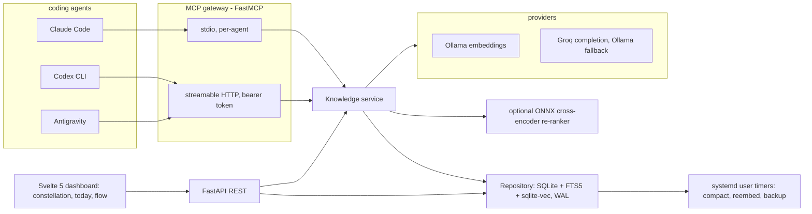

# Grimoire

Grimoire is an agent-native operating layer, not a note-taking app. Coding agents (Claude
Code, Codex CLI, Google Antigravity) read and write one shared store through an MCP
gateway: project context, documents, distilled memory, tasks, habits, goals, and a day
schedule. The store computes things a folder of files cannot: urgency quadrants, habit
streaks, a greedy day plan, recency-decayed and hybrid-fused retrieval.

## Why not Obsidian (or a folder of markdown)

Obsidian is static text plus a human UI: you open a note, you read it, a human decides
what is stale. Grimoire is computed state: urgency quadrants recompute daily from goal
deadlines, habit streaks recompute from a completion log, the day schedule recomputes
from anchors and remaining time, and retrieval recomputes relevance from similarity,
lexical match, and recency decay, not from folder position. On top of that state sits an
agent-writable MCP surface (`kb_*` tools) and semantic retrieval (hybrid vector + BM25,
optionally cross-encoder re-ranked). A markdown vault has none of that: it is read by
humans and grepped by agents, nothing is computed, nothing decays, nothing schedules
itself. See [BENCHMARKS.md](./BENCHMARKS.md) for retrieval quality evidence (hybrid vs.
vector-only vs. keyword-only, with and without re-ranking).

## Architecture



## MCP tool surface (kb_*)

Every tool is wrapped in an OpenTelemetry span (duration, project, chunk/row counts).
Claude Desktop and other full-surface agents get every tool below; the in-tab Groq chat
agent in the dashboard gets a capped slice (see `grimoire/planner/chat_router.py`).

### Knowledge layer (documents, memory, projects, graph)

| Tool | Purpose |
|---|---|
| `kb_retrieve` | Retrieve the most relevant chunks for a query, project-scoped or global |
| `kb_write_memory` | Write a distilled session memory (chronicle), embedded and linked to a project |
| `kb_get_project` | Return a project hub: node, living context, one hop of linked nodes |
| `kb_upsert_project` | Create or update a project hub in place |
| `kb_ingest_document` | Ingest a document (PDF/HTML/markdown) into the store, linked to a project |
| `kb_delete_node` | Hard-delete a node and everything that depends on it (edges, chunks, vectors, raw turns) |
| `kb_recluster` | Recompute Louvain communities over the graph and persist community ids |
| `kb_history` | Bitemporal timeline of a node: its superseded edges and memories over time |
| `kb_export_markdown` | One-way export of the store as an Obsidian vault with wikilinks |

`kb_retrieve` takes `mode=hybrid|vector|keyword`. Hybrid runs BM25 over SQLite FTS5 and
vector search over sqlite-vec in parallel, fuses them with reciprocal rank fusion (k=60),
applies recency decay after fusion, then optionally re-ranks the top candidates with a
local cross-encoder. Vector-only and keyword-only skip the fusion step, for comparison
and debugging.

### Planner layer (Today + Flow)

| Tool | Purpose |
|---|---|
| `kb_today` | Full Today view: habits with streaks, the four Eisenhower quadrants, goals by area, weekly report, focus-time estimate |
| `kb_create_task` | Create a task (importance is manual, urgency derives from a linked goal's deadline unless overridden) |
| `kb_modify_task` | Modify a task by id |
| `kb_complete_task` | Mark a task done or reopen it |
| `kb_delete_task` | Permanently delete a task |
| `kb_create_habit` | Create a recurring habit (daily or weekly), with timing fields for the Flow scheduler |
| `kb_toggle_habit` | Toggle a habit's completion for a day, recomputes its streak |
| `kb_delete_habit` | Permanently delete a habit and its completion log |
| `kb_weekly_report` | Weekly habit-consistency report (per-habit hit rate + overall percent) |
| `kb_create_goal` | Create a goal under a life area, with a target date that drives task urgency |
| `kb_modify_goal` | Modify a goal by id (changing target_date re-runs urgency for its tasks) |
| `kb_delete_goal` | Permanently delete a goal (its tasks are detached, not deleted) |
| `kb_list_goals` | Active goals, priority + deadline ordered, grouped by area |
| `kb_project_tasks` | Open tasks linked to a project node |
| `kb_generate_day` | Generate today's greedy schedule from wake/sleep times, reserving a goal-floor block |
| `kb_reflow_day` | Reflow the rest of today from now, preserving locked/completed blocks and the goal floor |
| `kb_add_anchor` | Add a hard (pinned) or soft (windowed) anchor to a day |
| `kb_delete_anchor` | Remove an anchor by id |
| `kb_recompute_urgency` | Run the daily urgency sweep (deadline-driven quadrant promotion across open tasks) |

## Design decisions

**SQLite over Neo4j or a dedicated vector database.** The graph is a few thousand nodes
per user, not millions of vectors. SQLite plus FTS5 (lexical) plus sqlite-vec (vector) in
one WAL-mode file gives traversal, full-text, and vector search without running a second
server, backing up a second system, or reasoning about two consistency models. Revisit
only past the scale where SQLite's single-writer model actually binds.

**Bitemporal validity columns, not Graphiti.** Nodes and edges gain `valid_from` /
`invalidated_at`; updates supersede a row rather than overwrite it, so `kb_history` can
replay what a node believed at any point in time. This is deliberately smaller than
adopting a temporal-graph library: it is a couple of columns and a supersede-instead-of-
update convention in the repository layer, not a new dependency or a new query language.

**Hybrid retrieval (BM25 + vector, fused with RRF).** Vector search recalls broadly but
is weak on exact identifiers, error codes, and proper nouns, terms that a dense embedding
smooths over. BM25 over FTS5 catches those exactly. Reciprocal rank fusion combines the
two rankings without needing to calibrate their scores against each other, then recency
decay applies once, after fusion, so it biases the merged order rather than each side
independently.

**Local cross-encoder re-rank as a second stage.** A bi-encoder (the embedding model)
scores query and passage independently, which is what makes it fast enough to search the
whole store. A cross-encoder scores them jointly, which is far more precise but too slow
to run over everything. So retrieval recalls broadly and cheaply, then re-ranks only the
top candidates with a small ONNX cross-encoder (CPU-only, no torch, no GPU), best-effort:
any failure falls back to the fused order.

**Edge provenance tags (explicit vs. inferred).** An edge an agent or user states directly
(`belongs_to`, a document ingested into a project) is trusted differently than one the
system infers (a suggested link from clustering or similarity). Tagging provenance now
keeps that distinction available for trust scoring and future auto-linking, without
having to backfill it later.

**The repository layer as the only SQL module.** `grimoire/store/repository.py` is the
only code that issues SQL or touches sqlite-vec directly; everything else calls its
intent-methods. That is the seam that makes the storage engine reversible: swapping
SQLite for something else touches one module, not every caller.

## Node types

| Grimoire name | Node type | Holds |
|---|---|---|
| Quest line | `project` | The hub: status idea / active / shipped / archived |
| Tome | `document` | Reference material, converted to markdown before chunking |
| Chronicle | `memory` | Distilled session records (raw turns stay unindexed, only summaries are embedded) |
| Rune | `entity` | Reusable APIs, skills, tools, people; can link projects |

## Setup

```bash
python3 -m venv .venv
.venv/bin/pip install -e ".[dev]"
cp .env.example .env
```

```bash
# tests use the deterministic offline FakeProvider: no Ollama or network needed
GRIMOIRE_PROVIDER=fake .venv/bin/python -m pytest
```

```bash
# REST API + dashboard (serves frontend/dist if built, otherwise API only)
.venv/bin/uvicorn grimoire.api:app --port 8731
```

```bash
# dashboard (Svelte 5 + Vite)
npm --prefix frontend install
npm --prefix frontend run build     # or: npm --prefix frontend run dev, for hot reload on :5173
```

Set `GRIMOIRE_RERANK_ENABLED=false` to skip loading the cross-encoder (faster boot,
lower memory, slightly lower precision on ambiguous queries).

### MCP client config (stdio)

```json
{
  "mcpServers": {
    "grimoire": {
      "command": "/home/adyu/apps/grimoire/.venv/bin/python",
      "args": ["-m", "grimoire.gateway"],
      "env": { "GRIMOIRE_DB_PATH": "/home/adyu/apps/grimoire/data/grimoire.db" }
    }
  }
}
```

## Deploy (current: WSL2 laptop, systemd user services)

Grimoire runs as two systemd **user** services on a WSL2 laptop, fronted by a Cloudflare
tunnel (no ports opened on the host, TLS terminated by Cloudflare):

| Service | Port | Role |
|---|---|---|
| `grimoire-web` | `:8731` | REST API + the built Svelte dashboard |
| `grimoire-mcp` | `:8730` | MCP gateway over streamable HTTP, behind a bearer token |

Write-capable REST routes (every POST/PUT/PATCH/DELETE under `/api`) are guarded by
`GRIMOIRE_API_TOKEN` once it is set: requests need `Authorization: Bearer <token>`, and
the dashboard sends it automatically after you paste the token into its Settings page.
Empty token = no check, for local-only use.

Ollama (embeddings, and completion fallback behind Groq) runs on the Windows host and is
reached from WSL2 over the network; `GRIMOIRE_OLLAMA_URL=auto` resolves the Windows
gateway IP at startup. systemd user timers handle maintenance: compact, reembed, backup.

```bash
systemctl --user restart grimoire-web    # after backend edits
systemctl --user restart grimoire-mcp
journalctl --user -u grimoire-web -f     # logs
```

A build + restart is the full deploy: `npm --prefix frontend run build`, then restart
`grimoire-web`.

## Planner (Today + Flow)

- **Today**: habits with streaks, tasks sorted into the four Eisenhower quadrants
  (important x urgent), goals by life area, a weekly consistency report.
- **Flow**: a greedy day scheduler that places tasks and habits around fixed anchors
  (wake time, sleep target, hard commitments), reserving a floor block for goal work, and
  reflows the remainder of the day from "now" without disturbing locked or completed
  blocks.
- Urgency is not static: a daily sweep promotes tasks from "important, not yet urgent" to
  "important and urgent" as their linked goal's deadline approaches.
